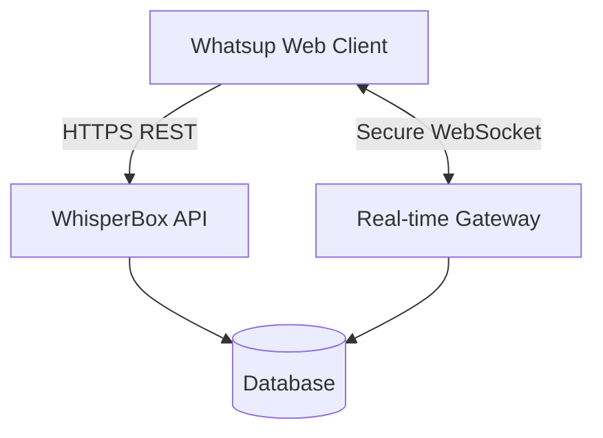

# Whatsup (Powered by WhisperBox API)

Whatsup is a secure, End-to-End Encrypted (E2EE) messaging application built with React, Vite, and Tailwind CSS. It leverages the Web Crypto API to ensure zero-knowledge architecture, meaning the WhisperBox server never sees the plaintext contents of your messages or your private keys.

## Architecture & Data Flow

The application interfaces with the WhisperBox REST API and WebSocket gateway:

1. **Authentication & Keys**: During registration, an RSA keypair is generated locally. The private key is wrapped using AES-KW derived via PBKDF2 from your password, and then securely stored on the server.
2. **REST API**: Used for authentication, querying users, retrieving conversation history, and as a fallback for message sending.
3. **WebSocket**: The real-time engine connects via `/ws?token=...` allowing for instant message delivery and presence indicators (online/offline state).

## End-to-End Encryption Flow

Whatsup implements a highly secure Hybrid Encryption protocol:

1. **Symmetric Payload**: When sending a message, a fresh `AES-GCM` 256-bit key is generated alongside a random 96-bit Initialization Vector (`IV`). The plaintext message is encrypted with this symmetric key.
2. **Asymmetric Key Wrapping**: The `AES-GCM` symmetric key is then encrypted (wrapped) twice using `RSA-OAEP` (2048-bit):
   - Once using the designated **Recipient's Public Key**.
   - Once using the **Sender's Public Key** (to ensure the sender can read their own sent messages across sessions or devices).
3. **Transmission**: The resulting payload (`ciphertext`, `iv`, `encrypted_key`, `encrypted_key_for_self`) is transmitted via WebSocket or HTTP POST. The server never possesses the keys required to decode the message payload.

## Key Management & State

We uphold a Zero-Knowledge philosophy regarding the users' identity keys:
- **Private Key**: Generated entirely in the browser using the Web Crypto API.
- **Key Wrapping**: The Private Key is encrypted via `AES-KW` prior to leaving the client. The wrapping key is derived locally from the raw user password using `PBKDF2` (100,000 iterations, SHA-256) and a 128-bit salt.
- **IndexedDB Storage**: During an active session, the decrypted Private Key is held securely inside `IndexedDB` with the Web Crypto API flag `extractable: false`. It is deliberately excluded from `localStorage` or cookies to mitigate cross-site scripting (XSS) data exfiltration risks.

## Stage 4B Security Enhancements

- **Replay Attack Prevention**: Every encrypted payload now embeds a cryptographic timestamp (e.g., `JSON.stringify({ text, timestamp })`). This structure prevents adversaries from capturing old ciphertext and replaying it at a later date undetected.
- **Input Sanitization**: Before encryption, all text strings are run through a strict sanitization pass (`str.replace(/</g, "&lt;").replace(/>/g, "&gt;")`). Paired with React's native HTML escaping, this ensures malicious XSS payloads are neutralized safely.

## Security Trade-offs & Known Limitations

- **Endpoint Compromise**: If the host machine or browser process is compromised by sophisticated malware or malicious browser extensions, the "in-memory" private keys could be extracted.
- **Browser State Clearance**: The unwrapped private key relies on `IndexedDB` for continuity between tabs and page refreshes. Clearing browser site data requires the user to sign in again to reconstruct the session context via password.
- **Self-Readability Bloat**: By guaranteeing self-readability natively through extra RSA-wrapped keys, every message incurs a minor size overhead. This is a deliberate trade-off for a cohesive multi-device experience without distributing symmetric keys insecurely.
